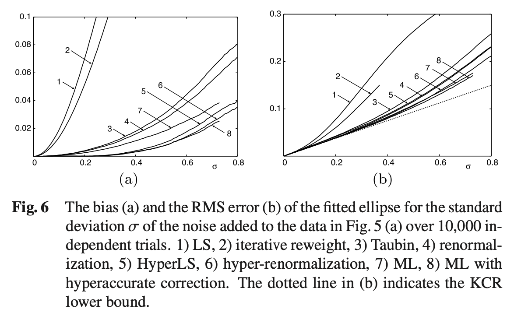
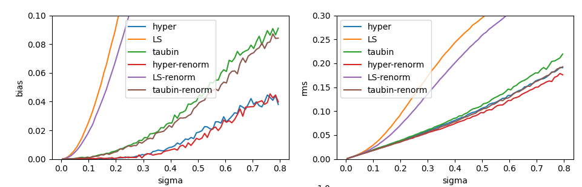

# Numpy Implementation of Hyperaccurate Ellipse fitting

- Hyperaccurate Ellipse Fitting without Iterations(Kanatani et al; 2010)
- Hyper-renormalization: Non-minimization Approach for Geometric Estimation (Kanatani et al; 2014)

## Basic Usage

```python
>>> import hyperaccurate_ellipse_fitting as hef
>>> hef.available_methods()[0]
{'name': 'hyper', 'description': ...}
>>> data = ...  # N x 2 array
>>> hef.fit(data, f0=np.linalg.norm(data, axis=1).mean(), n_max_iter=100)
...
```

By default function `fit` returns "Algebraic Representation" of ellipse,
which is the coefficients of defining polynomial.
The other useful representation is "Affine Representation"; tilt, center, axes length of the ellipse.
To convert between those parameter representations, use `affine2algebraic` or `algebraic2affine`.

## Reproduction

From paper:


Reproduced by `python -m hyperaccurate_ellipse_fitting.benchmark`:


## Test

`pytest hyperaccurate_ellipse_fitting/elltools.py --doctest-modules`
